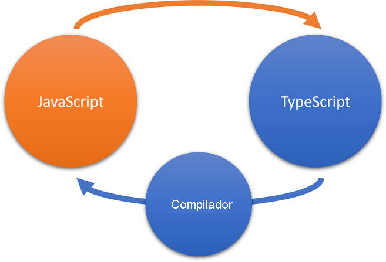

## Intro ao TypeScript

**[Site oficial](https://www.typescriptlang.org/)**

### O que é o TypeScript?
- **Superset do JavaScript**: qualquer código JavaScript válido é automaticamente código TypeScript válido. 
- **Tipagem Estática Opcional**: capacidade de adicionar tipos estáticos às variáveis, parâmetros de função e retornos de função. 
- **Compilação**: O TypeScript é compilado(ou Transpilado) para JavaScript antes de ser executado no navegador ou em qualquer ambiente que suporte JavaScript. A compilação transforma o código TypeScript, incluindo tipos, em código JavaScript puro que pode ser executado em qualquer lugar.
- **ECMAScript**: TypeScript acompanha as especificações do ECMAScript (o padrão no qual JavaScript é baseado) e, portanto, incorpora as mais recentes funcionalidades do JavaScript.
- **Orientação a Objetos e Módulos**: TypeScript suporta programação orientada a objetos e possui um sistema de módulos para organizar o código de maneira modular e reutilizável.

Em resumo, o TypeScript oferece uma abordagem mais segura e estruturada para o desenvolvimento JavaScript.



#### Instalação do TypeScript 
- **Node.js e npm**: Devemos ter o Node.js e o npm (gerenciador de pacotes do Node.js) instalados. 
Podemos baixá-los em nodejs.org.

- **Instalação Global do TypeScript:**
    ```
    npm install -g typescript
    ```

#### Compilação de Projetos TypeScript
- **Inicialização de um Projeto TypeScript:**
    Se estivermos começando um novo projeto, crie um arquivo **tsconfig.json** na raiz do seu projeto para configurar as opções do TypeScript. 
    Podemos fazer isso manualmente ou usar o comando:
    ```
    tsc --init
    ```
    O arquivo tsconfig.json contém configurações como o diretório de saída, versão do ECMAScript, entre outras opções.

- Arquivos TypeScript devem ser criados com a extensão **.ts**.
- **Compilação do Código:** Execute o comando **tsc** no terminal para compilar seu código TypeScript. Se tivermos um arquivo *tsconfig.json*, o TypeScript usará essas configurações.
```
tsc
```
- **Execução**
Agora, podemos executar o código JavaScript gerado normalmente. 

    Por exemplo, se tivermos um arquivo app.js, use 'node' para executá-lo:
```
node app.js
```

- **Automatizando a Compilação:** 
Aqui está um exemplo usando **npm scripts**:
    1. Adicione um script no seu arquivo package.json:
    ```
    "scripts": {
    "build": "tsc"
    }
    ```
    2. Execute o script usando:
    ```
    npm run build
    ```