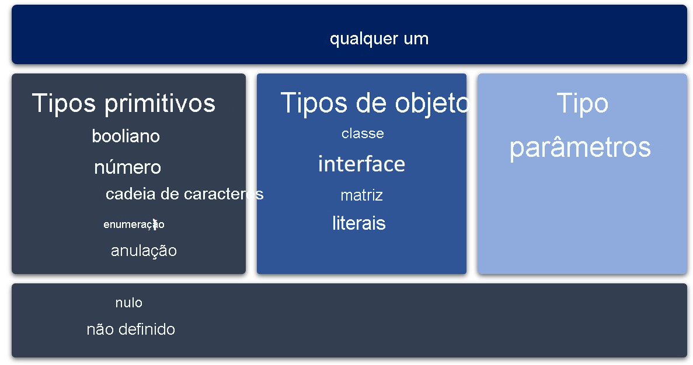

# Fundamentos do TypeScript

## O que são Tipos
O principal benefício do TypeScript é que ele permite que você adicione tipos estáticos a seu código JavaScript.

Os tipos colocam restrições estáticas em entidades de programa, como funções, variáveis e propriedades, para que compiladores e ferramentas de desenvolvimento possam oferecer melhor verificação e assistência durante o desenvolvimento.

O sistema de tipo estático em tempo de compilação permite que você expresse com precisão os relacionamentos de tipo que devem existir quando seus programas são executados. Em seguida, tenha essas suposições pré-validadas pelo compilador TypeScript.
A análise de tipo do TypeScript ocorre inteiramente em tempo de compilação e não adiciona sobrecarga de tempo de execução ao programa.


### Declaração de variáveis let e const
ECMAScript 2015 adicionou as palavras-chave **let** e **const** para a declaração de variável em JavaScript, o que eliminou alguns dos problemas associados à palavra-chave **var** em versões anteriores.

Essa alteração possibilita declarar variáveis com escopo de nível de bloco e impede que você declare a mesma variável várias vezes.

O TypeScript incentiva o uso das palavras-chave let e const para declarações de variáveis.

>A diferença entre elas é que as declarações **let** podem ser feitas sem inicialização, enquanto as declarações **const** são sempre inicializadas com um valor. E as declarações **const**, <ins>uma vez atribuídas, nunca poderão ser reatribuídas.</ins>

## Tipos e subtipos no TypeScript

### Any

Todos os tipos no TypeScript são subtipos de um tipo principal chamado tipo **any**.

- O tipo **any** é um tipo que pode representar qualquer valor de JavaScript sem restrições.



### Tipos Primitivos

Os tipos primitivos são os tipos **boolean**, **number**, **string**, **void**, **null** e **undefined** juntamente com a enumeração ou os tipos **enum** definidos pelo usuário.

O tipo **void** existe apenas para indicar a ausência de um valor, como em uma função sem valor retornado. 

Os tipos **null** e **undefined** são subtipos de todos os outros tipos. Não é possível referenciar explicitamente os tipos **null** e **undefined**. Somente os valores desses tipos podem ser referenciados, usando os literais **null** e **undefined**.

#### Boolean

O tipo de dados mais básico é o valor **true** ou **false**, conhecido como **boolean**.

Por exemplo:
```
let flag: boolean;
let yes = true;
let no = false;
```

#### Number
Como no JavaScript, todos os números no TypeScript são valores de ponto flutuante ou BigIntegers.
 Esses números de ponto flutuante obtêm o tipo number, enquanto BigIntegers obtém o tipo bigint. 
Além de literais hexadecimais e decimais, o TypeScript também é compatível com literais binários e octais introduzidos no ECMAScript 2015.

Exemplo:
```
let w: number;
let x: number = 10;
let y = 0;
let z: number = 123.456;
let big: bigint = 100n;
```

#### String
A palavra-chave **string** representa sequências de caracteres armazenados como unidades de código UTF-16 Unicode. 
Como o JavaScript, o TypeScript também usa aspas duplas **(")** ou aspas simples **(')** para circundar dados de cadeia de caracteres.

Alguns exemplos:
```
let s: string;
let empty = "";
let abc = 'abc';
```

No TypeScript, você também pode usar cadeias de caracteres de modelo, que podem abranger várias linhas e ter expressões inseridas. Essas cadeias de caracteres são circundadas pelo caractere de acento grave/aspas simples **(`)** e as expressões inseridas são no formato **${ expr }**.

Por exemplo:
```
let firstName: string = "Rafael";
let sentence: string = `My name is ${firstName}.
    I am coding TypeScript.`;
console.log(sentence);
```
Esse exemplo gera a saída:
```
My name is Rafael.
    I am coding TypeScript.
```

## Type Annotation e Type Inference

- **Annotation**: é quando definimos o tipo manualmente. 
    Isso é feito usando o caractere de dois pontos (**:**) seguido pelo tipo desejado.
    Exemplo:
    ```
    // Anotação de tipo para variável
    let numero: number;
    ```

- **Inference**: é a capacidade do TypeScript de deduzir automaticamente o tipo de uma variável, com base no valor atribuído a ela.
    Exemplo:
    ```
    // Inferência de tipo
    let numeroInferido = 5; // TypeScript infere que 'numeroInferido' é do tipo number
    ```

 ### Gerando arquivo de configuração 

 Para criar o arquivo de configuração **tsconfig.json** utilizamos: ```tsc --init```

### Compilar automaticamente

Para gerar a compilação automática sempre que salvamos o projeto, utilizamos o comando: ``` tsc -w ```


